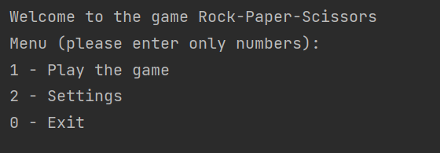

# RPS
RPS - Rock-Paper-Scissors game

Rules:

- Rock beats scissors
- Scissors beats paper
- Paper beats rock
- Identical throws tie (rock == rock, etc.)

# Info
The game is a console application, to play the game you need to clone the repo and run it in intellij or other java IDEs. 
When you run it, you saw

It is menu and has 3 items. To play game enter 1 and to customise the game enter 2. If you enter 1, you saw following question:

After entering appropriate number you will see this message:

To exit the game enter 0.

# Settings - New Feature
This page is new feature to game. In this menu you can customise the game by
adding additional choices, for example hammer or gun, or you can delete choices.
This will add flexibility to the game as it is controlled dynamically.

While adding choices you should define new choice's combinations with
other choices, for instance, rock beats hammer, paper cannot beat hammer and so on

Enjoy the game!

